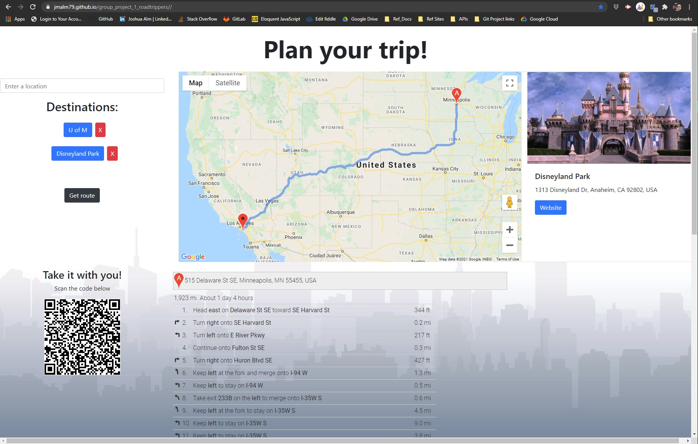

# group_project_1_roadtrippers
Combined_work Josh, Nathan, Bill &amp; Henry

## Link
* <https://jmalm79.github.io/group_project_1_roadtrippers//>   

Group Project 1: Roadtrip planner. 

## Overview

Enter locations you are interested in, 
When you "search" you will create a button for the place searched. (if you decide to not visit any place, you can use the "X" next to the button to delete it.)

Click on the newly created button preview picture with website link (if applicable) Note: websites will always open in new tab. 

Once you have your list created, select "Get route" this will generate a customized route for you. Once the list is generated, simply scan the QrCode with your camera app to open the route to your phone.

Hint: If you are planning a round trip, enter your starting location first, and again when all other locations have been entered. 

